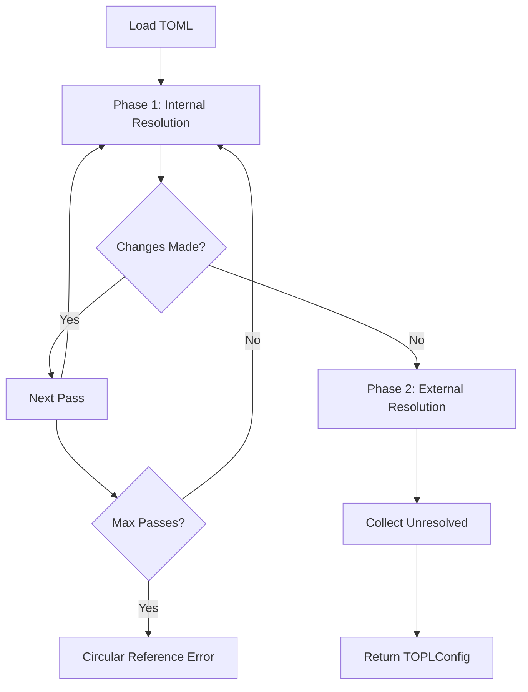

# Chapter 4: Two-Phase Resolution System

The heart of TOPL is its two-phase resolution system, which provides predictable and powerful placeholder resolution. This chapter explains how it works and why this approach is superior to single-pass systems.

## Overview

TOPL resolves placeholders in two distinct phases:

1. **Phase 1 (Internal)**: Resolves `${section.key}` references within the same TOML structure
2. **Phase 2 (External)**: Resolves `${parameter}` placeholders using user-provided parameters

This separation ensures predictable resolution order and prevents conflicts between internal structure and external parameters.

## Phase 1: Internal Resolution

### How It Works

The internal phase resolves references that point to other keys within the same TOML file.

```toml
# Before resolution
[database]
host = "localhost"
port = 5432
name = "myapp"
url = "postgresql://${database.host}:${database.port}/${database.name}"

[app]
name = "MyApplication"
database_name = "${database.name}"
```

### Resolution Process

1. **Scan**: Find all `${...}` placeholders in string values
2. **Match**: Check if placeholder path exists in the TOML structure
3. **Replace**: Substitute with the referenced value
4. **Repeat**: Continue until no more changes occur (up to 10 iterations)

```python
# After Phase 1
{
  'database': {
    'host': 'localhost',
    'port': 5432,
    'name': 'myapp',
    'url': 'postgresql://localhost:5432/myapp'  # ← Resolved
  },
  'app': {
    'name': 'MyApplication',
    'database_name': 'myapp'  # ← Resolved
  }
}
```

### Multi-Pass Resolution

Internal resolution supports multiple passes for complex references:

```toml
[config]
base_path = "/var/app"
data_path = "${config.base_path}/data"
log_path = "${config.data_path}/logs"  # References data_path, which references base_path
backup_path = "${config.log_path}/backups"  # Three levels deep

# Final result:
# base_path = "/var/app"
# data_path = "/var/app/data"  
# log_path = "/var/app/data/logs"
# backup_path = "/var/app/data/logs/backups"
```

### Circular Reference Detection

TOPL prevents infinite loops by limiting internal passes to 10 iterations:

```toml
# This would cause infinite recursion
[bad]
a = "${bad.b}"
b = "${bad.a}"
```

```python
# Raises CircularReferenceError
from topl.exceptions import CircularReferenceError

try:
    config = resolve_placeholders(data)
except CircularReferenceError as e:
    print("Circular reference detected!")
```

## Phase 2: External Resolution

### How It Works

After internal resolution is complete, remaining placeholders are resolved using external parameters.

```toml
# After Phase 1, before Phase 2
[api]
base_url = "https://api.company.com"
key = "${API_KEY}"  # ← Still unresolved
endpoint = "${api.base_url}/v1"  # ← Already resolved in Phase 1

[database]  
host = "${DB_HOST}"  # ← Needs external parameter
url = "postgresql://${database.host}:5432/myapp"  # ← Partially resolved
```

### Resolution Process

1. **Scan**: Find remaining `${...}` placeholders
2. **Match**: Look up parameter in external parameters
3. **Replace**: Substitute with parameter value
4. **Leave**: Unmatched placeholders remain unchanged

```python
# Provide external parameters
config = resolve_placeholders(
    data,
    API_KEY="sk-abc123",
    DB_HOST="prod-server.com"
)

# Result after Phase 2
{
  'api': {
    'base_url': 'https://api.company.com',
    'key': 'sk-abc123',  # ← Resolved externally
    'endpoint': 'https://api.company.com/v1'
  },
  'database': {
    'host': 'prod-server.com',  # ← Resolved externally
    'url': 'postgresql://prod-server.com:5432/myapp'  # ← Fully resolved
  }
}
```

## Resolution Examples

### Example 1: Simple Internal References

```toml
[server]
host = "localhost"
port = 8080

[client]
server_url = "http://${server.host}:${server.port}"
```

**Phase 1**: `server_url` becomes `"http://localhost:8080"`  
**Phase 2**: No external placeholders, no changes

### Example 2: Mixed Resolution

```toml
[app]
name = "myapp"
version = "1.0.0"

[deployment]
environment = "${ENVIRONMENT}"  # External
image = "${app.name}:${app.version}"  # Internal
tag = "${deployment.image}-${BUILD_ID}"  # Mixed
```

**Phase 1**: 
- `image` becomes `"myapp:1.0.0"`
- `tag` becomes `"myapp:1.0.0-${BUILD_ID}"`

**Phase 2** (with `ENVIRONMENT="prod"`, `BUILD_ID="123"`):
- `environment` becomes `"prod"`
- `tag` becomes `"myapp:1.0.0-123"`

### Example 3: Nested Environment Selection

```toml
[environments.dev]
debug = true
db_host = "localhost"

[environments.prod]
debug = false
db_host = "prod-db.com"

[app]
current_env = "${ENVIRONMENT}"
debug_mode = "${environments.${ENVIRONMENT}.debug}"
database_host = "${environments.${ENVIRONMENT}.db_host}"
```

**Phase 1**: No internal resolution possible (references external `${ENVIRONMENT}`)

**Phase 2** (with `ENVIRONMENT="prod"`):
- `current_env` becomes `"prod"`
- Now `${environments.prod.debug}` can be resolved to `false`
- `debug_mode` becomes `false`
- `database_host` becomes `"prod-db.com"`

## Advanced Resolution Scenarios

### Conditional-Like Logic

```toml
[flags]
debug = true
environment = "${ENVIRONMENT}"

[logging]
# Different log levels based on debug flag
level = "${flags.debug}"  # Will be true/false

[database]
# Different settings per environment
host = "${${flags.environment}_DB_HOST}"  # Requires DEV_DB_HOST, PROD_DB_HOST, etc.
```

### Template Hierarchies

```toml
[templates.base]
protocol = "https"
domain = "company.com"
version = "v1"

[templates.api]
base_url = "${templates.base.protocol}://${templates.base.domain}"
versioned_url = "${templates.api.base_url}/${templates.base.version}"

[services.users]
endpoint = "${templates.api.versioned_url}/users"
auth_endpoint = "${services.users.endpoint}/auth"
```

## Resolution Order and Priority

### Priority Rules

1. **Internal references** are always resolved first
2. **External parameters** only apply to unresolved placeholders
3. **Most specific paths** take precedence
4. **Case-sensitive** matching

### Resolution Flow



## Performance Characteristics

### Time Complexity

- **Internal resolution**: O(n × m × p) where:
  - n = number of string values
  - m = number of placeholders per value
  - p = resolution passes (max 10)
- **External resolution**: O(n × m) single pass

### Memory Usage

- **Minimal overhead**: Only active during resolution
- **Deep copying**: Input data is preserved
- **Garbage collection**: Intermediate objects are cleaned up

### Optimization Tips

```python
# For large configurations, consider streaming
import tomllib
from topl import resolve_placeholders

# Load only what you need
with open('large-config.toml', 'rb') as f:
    data = tomllib.load(f)
    
# Resolve with minimal parameters
config = resolve_placeholders(
    data,
    **{k: v for k, v in params.items() if k in required_params}
)
```

## Debugging Resolution

### Verbose Logging

```python
import logging
logging.basicConfig(level=logging.DEBUG)

config = resolve_placeholders(data, **params)
# See detailed resolution steps in logs
```

### Manual Resolution Tracking

```python
# Check resolution status
config = resolve_placeholders(data, **params)

if config.has_unresolved:
    print("Unresolved placeholders:")
    for placeholder in config.unresolved_placeholders:
        print(f"  {placeholder}")
```

## Common Pitfalls

### 1. Phase Confusion

```toml
# WRONG: Expecting external parameter to affect internal resolution
[app]
name = "${APP_NAME}"  # External
database = "${app.name}_db"  # This won't work as expected
```

**Solution**: External parameters are resolved after internal references.

### 2. Circular References

```toml
# WRONG: Circular dependency
[a]
value = "${b.value}"

[b]  
value = "${a.value}"
```

**Solution**: Design your configuration hierarchy to avoid cycles.

### 3. Case Sensitivity

```toml
[Server]  # Capital S
host = "localhost"

[client]
url = "${server.host}"  # lowercase s - won't match
```

**Solution**: Use consistent casing throughout your configuration.

## What's Next?

Now that you understand the resolution system:

- **Master the CLI** → [Chapter 5: CLI Reference](05-cli-reference.md)
- **Explore the API** → [Chapter 6: API Reference](06-api-reference.md)
- **See complex examples** → [Chapter 7: Configuration & Examples](07-configuration-examples.md)

## Quick Reference

### Resolution Phases
1. **Internal** → `${section.key}` (within file)
2. **External** → `${PARAMETER}` (from user)

### Key Properties
- **Deterministic**: Same input always produces same output
- **Safe**: Circular references are detected and prevented
- **Preserving**: Original data types are maintained
- **Extensible**: External parameters can be added without changing files